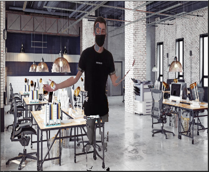

<p align="center">
  <a href="#"></a>

  <h1 align="center"> Background subtraction & Region Growing </h1>

  <p align="center">
    <br />
    <a href="#about-the-project">About the project</a>
    ·
    <a href="#built-with">Built With</a>
    ·
    <a href="#main-features">Main Features</a>
    ·
    <a href="#usage">Getting Started</a>
    .
    <a href="#gallery">Gallery</a>
    .
    <a href="#contact">Contact</a>
    <br>
    <br>
    <a href="https://www.linkedin.com/in/victor-combat/" target="_blank"></a>
  <a href="https://github.com/VictorCombat" target="_blank"></a>
  <a href="mailto:victor.cmbt@gmail.com" target="_blank"></a>
  </p>
</p>

<br>

## About the project

As part of the Image analysis course of the Master 1 Computer Science at the University Claude Bernard Lyon 1, we had a project whose objective is to put into practice methods and algorithms of analysis and image processing seen in course.

This project has been realized with the Python version of the OpenCV graphic library specialized in real time image processing.
This report contains the three-part structure of the project.
In the first part, we had to get to know OpenCV with basic processing on images, the second part consisted in extracting the silhouette of a person on a video, and finally we had to implement the region growing algorithm in a third part.

## Built With

* Python 3
* OpenCV

### Install

```bash
pip3 install matplotlib opencv_python numpy
```

## Main Features

<div style="margin-left: auto;
    margin-right: auto;
    width: 500px">

   | <div style="width: 250px"> Features </div>                                                                                                      | Status |
   | :---                                                                                                                                            | :---: |
   | Step 1 : Getting started with OpenCV using some common filters                                                                                  | ✅ |
   | Step 2 : Background subtraction                                                                                                                 | ✅ |
   | Step 3 : Implementing Region Growing algorithm on image                                                                                         | ✅ |
   | Step 3 bis : Implementing Region Growing algorithm on a video frame using an envelope to reduce the search area and using a grid to place seeds | ✅ |

</div>

## Usage

* Step 1 : `python3 ./step_1.py <file (optionnal)> `
* Step 2 : `python3 ./step_2.py`
* Step 3 Region Growing : `python3 ./step_3_region_growing.py <file (optionnal)> <threshold (optionnal)>`
* Step 3 Region Growing (auto) : `python3 ./step_3_region_growing_auto.py <threshold (optionnal)> <grid size (optionnal)>`

## Gallery

<details>
  <summary> Show gallery </summary>

   <br>
    
      
    
  
  
</details>

<!-- CONTACT -->
## Contact

<p align="center">
  <a href="https://www.linkedin.com/in/victor-combat/" target="_blank"></a>
  <a href="https://github.com/VictorCombat" target="_blank"></a>
  <a href="mailto:victor.cmbt@gmail.com" target="_blank"></a>
</p>

##
<p align="center">
  <a href="#"></a>
</p>
